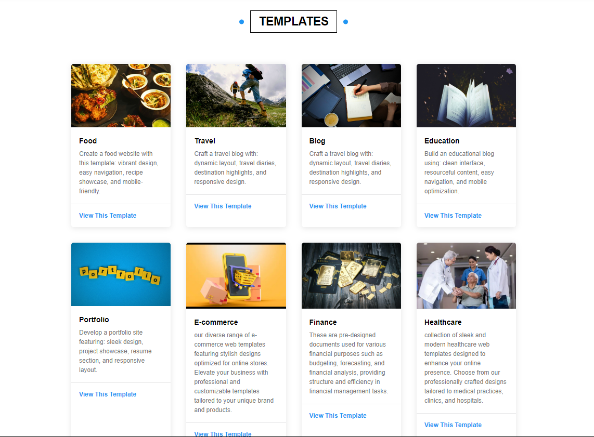

# Project: Design Junction by Team Vishisht

## Description
Design Junction is a modular website maker designed to simplify website creation by providing dynamic templates for various industries like Food, Education, Travel, Blog, Portfolio, E-commerce, Finance, Healthcare, etc. The project aims to make the coder's life easier by generating final HTML, CSS, and JS code after template editing. It also includes an admin panel and manager panel with role-based access for CRUD operations.


   
## Features
- **Easily Customizable:** Intuitive tools for tweaking design, content, and functionality without coding.
- **Wide Templating Options:** Diverse range of design templates and layouts.
- **Dynamic Website Creation:** Automatic generation of web pages with real-time data display.

## Templates
1. **Food Template:**
   - Description: Vibrant design, easy navigation, recipe showcase, and mobile-friendly.
   
2. **Travel Template:**
   - Description: Dynamic layout, travel diaries, destination highlights, and responsive design.

   ... (and other templates similarly)

   - 


## How It Works
1. **Select Template:** Choose a template from the available options.
2. **Customization:** Customize the template as per your needs.
3. **Deployment:** Deploy and use the customized template according to requirements.

## Team Members
- Rohan Vinkare
- Abhishek Sahay
- Mamtha Mude
- Prajwal Kumar
- Sujal Awargand

## Setup Guide
To set up the project on your PC, follow these steps:

1. **Clone Repository:**
   ```bash
  [ git clone https://github.com/TeamVishisht/design-junction.git](https://github.com/rohanvinkare/Design-Junction.git)


2. **Go to File**
   ```bash
   npm install

3. **Install Dependencies**
    ```bash
   npm install 

4. **Run Project**
    ```bash
   nodemon index.js


## Web Site Preview 
 - 
